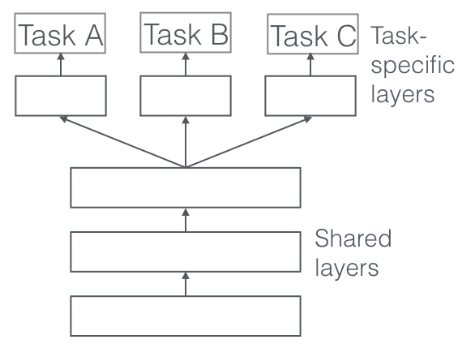

# Face Detection and Characterization with Deep Learning
Using deep learning regression technique to fing the faces in a image and using multi tasking 
learning to find some other characteristics of faces like race, age, position.


## Data set
IMFDB images dataset is used for this project, which contains all the indian actors faces and 
arrtibutes of it.

## Data Preparation
### gathering the files
getting all the txt files containing the characteristics of each image in all the folders.
```get_txt_files()``` function is used to get the list og all txt files in all the sub 
directories using ```glob``` package.
```python
def get_txt_files():
    txt_files = glob.glob('**/**/**/*.txt', recursive=True)
    txt_files_path = ["Main Folder" + s for s in txt_files]
    return txt_files_path

```

### text to csv and handling error in data
We need to convert all the txt files to csv files for easy accessibility using dataframes.
And we need to make sure all the image files in the csv files exists and all the attribute exists
 for each image.THis is done by 
 ```python
def txt_to_csv(files):
    common_df = pd.read_csv(files[0], sep='\t', header=None)
    l=[]
    for i, file in enumerate(files[1:]):
        print('{}/{}'.format(i, len(files)))
        try:
            print(file)
            df = pd.read_csv(file, sep='\t', header=None)
            common_df = common_df.append(df)
        except:
            print('ERROR in ',file)
            l.append(file)
            continue
        common_df.to_csv('face_data.csv')
        pd.DataFrame(l).to_csv('ERROR.csv')
```
<strong>result:</strong> 

```ERROR.csv``` file contains all the image with error in data.
```face_data.csv``` contains all the valid data.

### getting the necessary data
Removing un needed columns in the dataframe and getting the actual path of the image in the local
 system and their attributes like sex, age, emotion, face direction.
 ```python
def clean_csv():
    df = pd.read_csv('face_data.csv')
    print(df.head())
    cols = [0, 1, 8, 11, 12, 16, 17]
    df.drop(df.columns[cols], axis=1, inplace=True)
    print(df.head())
    df.to_csv('final_faces.csv')

def visualize_sample():
    df = pd.read_csv('face_data.csv')
    test = df.iloc[2870]
    path = 'main folder'+test[
        'actor']+'/'+test['movie']+'/images/'+test['name']
    sex = test['sex']
    emotion = test['emotion']
    age = test['age']
    face_direction = test['face_direction']
    print(path)
    print(set(df['emotion'].values))
    img = Image.open(path)
    d = ImageDraw.Draw(img)
    d.text((0, 0), sex+'\n'+emotion+'\n'+age+'\n'+face_direction, fill=(255, 255, 0))
    plt.imshow(img)
    plt.show()

def final_dataset():
    df = pd.read_csv('face_data.csv')
    row=[]
    for i in range(len(df)):
        print('{}/{}'.format(i,len(df)))
        try:
            test = df.iloc[i]
            path = 'main folder' + test['actor'] + '/' + test['movie'] + '/images/' + test['name']
            sex = test['sex']
            emotion = test['emotion']
            age = test['age']
            face_direction = test['face_direction']
            if os.path.isfile(path):
                row.append([path, sex, emotion, age, face_direction])
            else:
                continue
        except:
            print('ERROR in {}'.format(i))
            continue
    new_df = pd.DataFrame(row, columns=['image', 'sex', 'emotion', 'age', 'face_direction'])
    new_df.to_csv('final_csv_data.csv')
```

<strong> result:</strong>  ```final_csv_data.csv```  contains the location of the image int he 
disk and the needed attributes.

### seperating data by Image size 
I am not sure of what model architecture to use for this data , as the image size was distributed
 equally from size of 50 to 300.
 
We don't want to use image size of 50 and resize it to 224 , if we decide to use imagenet 
pretrained model for transfer learning.

So we seperate data into image size >50, >100, >128, >200 & >=224 . and we try out imagent models
 and our own model for image size <224.
 
 ```python
def split_data_on_size():
    df = pd.read_csv('final_csv_data.csv')
    list50=[]
    list100=[]
    list128=[]
    list200=[]
    list224=[]
    for i in range(len(df)):
        path = df.iloc[i]['image']
        h, w = Image.open(path).size
        l = min(h, w)
        if l >= 50:
            list50.append(df.iloc[i])
        if l >=100:
            list100.append(df.iloc[i])
        if l >= 128:
            list128.append(df.iloc[i])
        if l >= 200:
            list200.append(df.iloc[i])
        if l >= 224:
            list224.append(df.iloc[i])
    pd.DataFrame(list50).reset_index(drop=True).to_csv('list50.csv', index=None)
    pd.DataFrame(list100).reset_index(drop=True).to_csv('list100.csv', index=None)
    pd.DataFrame(list128).reset_index(drop=True).to_csv('list128.csv', index=None)
    pd.DataFrame(list200).reset_index(drop=True).to_csv('list200.csv', index=None)
    pd.DataFrame(list224).reset_index(drop=True).to_csv('list224.csv', index=None)
```

## Image data processing
As we are using different image sizes of >50, >100, >128, >200, >=224, we want to resize the 
images into a single size for each category.

The image has been :
1. Normalized ```norm_image()```
2. Resized and Padded ```resize_image()```


## MultiTasking Model



We use transfer learning to learn the features fo the image and use those features for each of 
our specific tasks like determining age, emotion, sex, face_direction and face deteion will be 
added later.

The base network is a pretrained VGG19 architecture , and we add 4 other networks for out 
classification tasks.

The Computation graph will look like above. and the final loss function will be average of losses 
of individual tasks.

I have used cross entropy as the loss function for each of the task.


## Future improvements to be made

1. adding segmentation model to segment the face from an image or video .
2. using autoencoders to blur out or segment the face from the image or video.
3. develope a web app to demonstrate this project.
